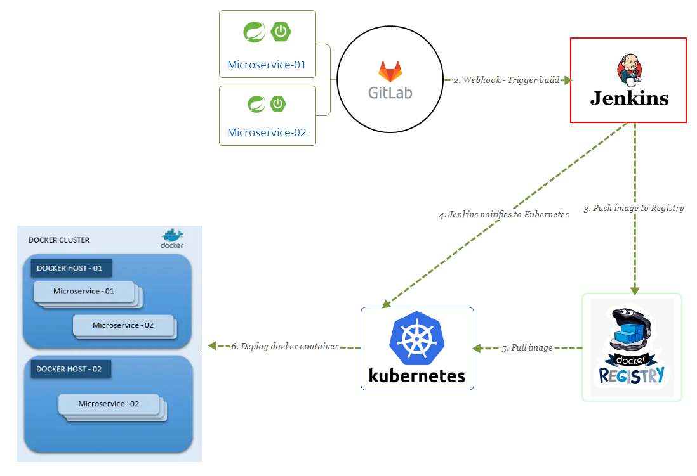

# Deploy Docker Image to Kubernetes using Jenkins



## Compile code

Tạo `Jenkinsfile` (hoặc Jenkins Pipeline script)  gồm 3 stage:

```Groovy
pipeline {
    agent any
    tools {
        maven 'mvn-3.6.3'
        jdk 'JDK 8'
    }

    environment {
        //docker_image = "harbor101-vn-south-1.hahalolo.com/tantran/es-rest-social"
        DOCKER_TAG = new Date().format('dd-MM-yyyy-HH-mm-ss')
        // DOCKER_IMAGE = 'registry.hlcdn.net/t-core-rest-api/es-rest-social-test'
    }
    stages {
        stage('Install Stage') {
            steps {
                script {
                    downstream_projects.split("\\r?\\n").each { project ->
                        println("Build maven project : ${project}")
                        git credentialsId: "${git_credential}", branch: "${branch}", url: "${gitlab_url}/${project}"
                        sh "mvn -Dmaven.test.failure.ignore=true -DlocalRepositoryPath=${jenkins_repo} clean install"
                        archiveArtifacts artifacts: '**/target/*.jar', followSymlinks: false
                    }
                }
            }
        }

        stage('Docker Build') {
            steps {
                //Build docker image theo tên repository. VD: Repository=es-rest-social → DOCKER_IMAGE=registry.hlcdn.net/t-core-rest-api/es-rest-social
                sh "docker build -t ${DOCKER_IMAGE}:${DOCKER_TAG} . --no-cache"
                //Đánh tag để tham chiếu các docker image.
                sh "docker tag ${DOCKER_IMAGE}:${DOCKER_TAG} ${DOCKER_IMAGE}:latest"            
                sh "docker image ls | grep ${DOCKER_IMAGE}"
                //Login to registry với credential lưu trong Jenkins, k8s_domain là domain của registry: registry.hlcdn.net
                withCredentials([usernamePassword(credentialsId: 'registry-credential', usernameVariable: 'DOCKER_USERNAME', passwordVariable: 'DOCKER_PASSWORD')]) {
                    sh "echo $DOCKER_PASSWORD | docker login ${K8S_DOMAIN} --username $DOCKER_USERNAME --password-stdin"
                    sh "docker push ${DOCKER_IMAGE}:${DOCKER_TAG}"
                    sh "docker push ${DOCKER_IMAGE}:latest"
                }

                //clean to save disk
                sh "docker image rm ${DOCKER_IMAGE}:${DOCKER_TAG}"
                sh "docker image rm ${DOCKER_IMAGE}:latest"
            }
        }

        stage('Deploy to K8s') {
            steps {
                script {
                    kubernetesDeploy(configs: 'k8s-deployment.yaml', kubeconfigId: 't-k8s-0-core-rest-api-config')
                }
            }
        }
    }
}
```

**Declarative**: Khai báo thông tin các tool cài đặt, biến môi trường. Trong đó các thông tin nào được dùng nhiều và có nhiều thay đổi thì nên khai báo các Parameters trong Jenkins pipeline. VD: DOCKER_IMAGE

```Groovy
agent any
tools {
    maven 'mvn-3.6.3'
    jdk 'JDK 8'
}

environment {
    //docker_image = "harbor101-vn-south-1.hahalolo.com/tantran/es-rest-social"
    DOCKER_TAG = new Date().format('dd-MM-yyyy-HH-mm-ss')
    // DOCKER_IMAGE = 'registry.hlcdn.net/t-core-rest-api/es-rest-social-test'
}
```

**Stage Install**: Quá trình compile và install code java

```Groovy
stage('Install Stage') {
    steps {
        script {
            downstream_projects.split("\\r?\\n").each { project ->
                println("Build maven project : ${project}")
                git credentialsId: "${git_credential}", branch: "${branch}", url: "${gitlab_url}/${project}"
                sh "mvn -Dmaven.test.failure.ignore=true -DlocalRepositoryPath=${jenkins_repo} clean install"
                archiveArtifacts artifacts: '**/target/*.jar', followSymlinks: false
            }
        }
    }
}
```

## Build Docker Image

Tạo DOCKERFILE chứa thông tin config của docker image, copy file jar của project vào docker, executed jar khi docker chạy.

`ENTRYPOINT ["java","-Dlog4j.formatMsgNoLookups=true","-Dspring.profiles.active=k8s","-jar","/app.jar"]`

```Dockerfile
FROM openjdk:11.0.13-jdk-slim
ENV TZ=Asia/Ho_Chi_Minh
ENV PATH="/usr/local/openjdk-11/bin:/usr/local/sbin:/usr/local/bin:/usr/sbin:/usr/bin:/sbin:/bin:/usr/games:/usr/local/games:/snap/bin"
ENV CONFIG_USERNAME="config"
ENV CONFIG_PASSWORD="admin"


#COPY es-rest-social-1.0.0-SNAPSHOT.jar app.jar
COPY target/*.jar app.jar
#CMD to be executed when docker is run.
ENTRYPOINT ["java","-Dlog4j.formatMsgNoLookups=true","-Dspring.profiles.active=k8s","-jar","/app.jar"]
```

**Stage Docker Build**: Build docker image theo tên repository. `VD: Repository=es-rest-social → docker_image= registry.hlcdn.net/t-core-rest-api/ es-rest-social:[docker_tag]`

```Groovy
stage('Docker Build') {
    steps {
        //Build docker image theo tên repository. VD: Repository=es-rest-social → DOCKER_IMAGE=registry.hlcdn.net/t-core-rest-api/es-rest-social
        sh "docker build -t ${DOCKER_IMAGE}:${DOCKER_TAG} . --no-cache"
        //Đánh tag để tham chiếu các docker image.
        sh "docker tag ${DOCKER_IMAGE}:${DOCKER_TAG} ${DOCKER_IMAGE}:latest"            
        sh "docker image ls | grep ${DOCKER_IMAGE}"
        //Login to registry với credential lưu trong Jenkins, k8s_domain là domain của registry: registry.hlcdn.net
        withCredentials([usernamePassword(credentialsId: 'registry-credential', usernameVariable: 'DOCKER_USERNAME', passwordVariable: 'DOCKER_PASSWORD')]) {
            sh "echo $DOCKER_PASSWORD | docker login ${K8S_DOMAIN} --username $DOCKER_USERNAME --password-stdin"
            sh "docker push ${DOCKER_IMAGE}:${DOCKER_TAG}"
            sh "docker push ${DOCKER_IMAGE}:latest"
        }

        //clean to save disk
        sh "docker image rm ${DOCKER_IMAGE}:${DOCKER_TAG}"
        sh "docker image rm ${DOCKER_IMAGE}:latest"
    }
}
```

***#Tag image***

Đánh tag để tham chiếu các docker image

`docker tag SOURCE_IMAGE[:TAG] registry.hlcdn.net/t-core-rest-api/REPOSITORY[:TAG]`

***#Login Registry***

Login vào registry với credential lưu trong Jenkins, `k8s_domain` là domain của registry: `registry.hlcdn.net`

```Groovy
withCredentials([usernamePassword(credentialsId: 'registry-credential', usernameVariable: 'DOCKER_USERNAME', passwordVariable: 'DOCKER_PASSWORD')]) {
    sh "echo $DOCKER_PASSWORD | docker login ${K8S_DOMAIN} --username $DOCKER_USERNAME --password-stdin"
}
```

## Push image to docker registry

***#Push docker image***

Push docker image lên Docker Registry

```Groovy
sh "docker push ${DOCKER_IMAGE}:${DOCKER_TAG}"
sh "docker push ${DOCKER_IMAGE}:latest"
```

***#Clean docker image***

Xóa docker image để tiết kiệm bộ nhớ

```Groovy
sh "docker image rm ${DOCKER_IMAGE}:${DOCKER_TAG}"
sh "docker image rm ${DOCKER_IMAGE}:latest"
```

## Notifies for Kubernetes to pull new images from the registry

**Stage Deploy to K8s**:

Deploy image lên K8S dựa theo file `k8s-deployment.yaml` và thông tin config `t-k8s-0-core-rest-api-config` lưu trên Jenkins

```Groovy
stage('Deploy to K8s') {
    steps {
        script {
            kubernetesDeploy(configs: 'k8s-deployment.yaml', kubeconfigId: 't-k8s-0-core-rest-api-config')
        }
    }
}
```

File `k8s-deployment.yaml`

```YAML
apiVersion: apps/v1
kind: Deployment
metadata:
  namespace: 0-core-rest-api
  name: es-rest-social-test
spec:
  replicas: 3
  selector:
    matchLabels:
      app: es-rest-social-test
      version: blue
  template:
    metadata:
      labels:
        app: es-rest-social-test
        version: blue
    spec:
      containers:
      - name: es-rest-social-test
        image: ${DOCKER_IMAGE}:${DOCKER_TAG}
        resources:
          limits:
            cpu: '5'
            memory: 32Gi
          requests:
            cpu: '0.5'
            memory: 256Mi
      tolerations:
        - key: node.kubernetes.io/node
          operator: Equal
          value: java
          effect: NoSchedule 
      imagePullSecrets:
      - name: t-registry-be
      nodeSelector:
        kubernetes.io/hostname: t-k8s-2021-worker-11
```

Trong đó `imagePullSecrets: t-registry-be` được tạo vào lưu trong Kubernetes chứa thông tin login vào Docker Registry

```t
{"auths":{"registry.hlcdn.net":{"username":"t-dev-be","password":"Hahalolo@2022","auth":"dC1kZXYtYmU6SGFoYWxvbG9AMjAyMg=="}}}
```

## Deploy and manage images and containers

Vào Dashboard: [t-k8s-dash.hahalolo.com](https://t-k8s-dash.hahalolo.com/#/login) login với file config `dev-test-core-rest-api-k8s-config`, chọn namespace `0-core-rest-api` để kiểm tra image.
