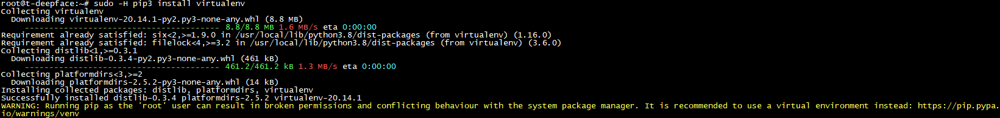
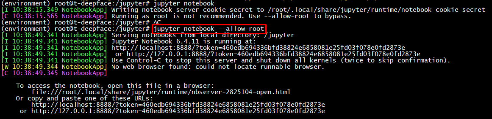

# Install Jupyter notebook on Ubuntu 20.04

## Install pip3

`sudo apt install python3-pip python3-div`

Nếu đã cài pip3 thì dùng lệnh upgrade pip : `sudo -H pip3 install --upgrade pip`


## Create virtual environment

`sudo -H pip3 install virtualenv`



## Create thư mục cho virtualenv

`mkdir jupyter`

## Create Python virtual-environment, tên 'environment'

`virtualenv environment`


## First load virtual-environment before install Jupyter

### Use path 'bin/activate' to active environment

`source environment/bin/activate`


## Download Jupyter in a virtual-environment

`pip install jupyter`


## Run Jupyter

`jupyter notebook` thêm optional --allow-root nếu đang chạy user root



Output sẽ có cảnh bảo `No web browser found: could not locate runnable browser.` do server hoạt động no GUI, nhưng ko ảnh hưởng đến kết quả. Tiếp tục sử dụng SSH Tunel để kết nối tới Jupyter Notebook

# Connecting to the Jupyter Notebook Application with SSH Tunneling

# For End-user

## Use Powershell on Windows to connect SSH

Mở Terminal hoặc Powershell trên Windows, sử dụng lệnh SSH với optional -L để chỉ định một cổng nhất định trên host sẽ được chuyển tiếp đến máy chủ và cổng trên remote server.
Điều này có nghĩa là bất kỳ nội dung nào đang chạy trên cổng được chỉ định trên remote server (8888, cổng mặc định của Jupyter Notebook) sẽ xuất hiện trên cổng được chỉ định trên host (ví dụ cổng 8000).

`ssh -L 8000:localhost:8888 root@10.10.15.87`


Di chuyển tới thư mục Jupyter
`cd ../jupyter/`


## After connect SSH, active virtual-environment and run Jupyter

Dùng lệnh `source environment/bin/activate` để kích hoạt environment. Và chạy Jupyter notebook với optional --allow-root.

```text
jupyter notebook --allow-root
```


## Use Browser connect to Jupyter Notebook

Trên máy host nhập đường dẫn vào trình duyệt để dùng Jupter Notebook.
`http://localhost:8000/`


Nhập token:

Token auto generate khi chạy Jupyter notebook.

