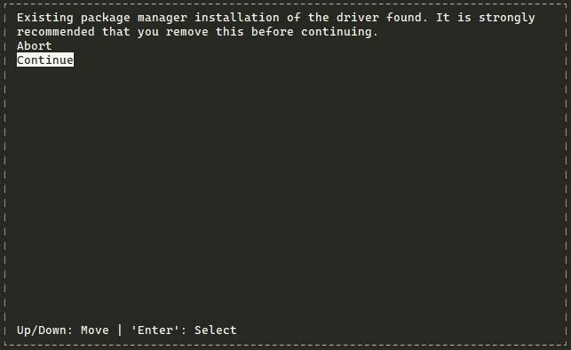
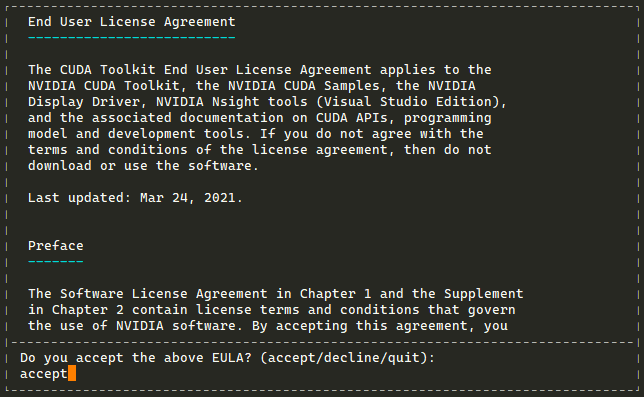
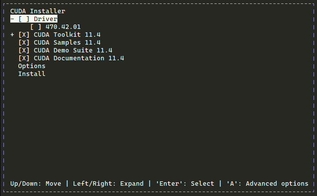

# ***Setup for deep learning development on server Ubuntu 20.04***

> [reference link](https://deeplearningcrashcourse.org/setup_ubuntu/)  

Full guideline provides tutorial for setup deep learning development environment on Ubuntu 20.04. This guide demonstrates the setup for GPU as well as the python components and software.

As an overview, following software and tools are used for server:

```
* Python3.8
* Pytorch 1.9, for cuda 11
* VSCode for coding and debugging
* wandb (weights and biases) for the experiment management and hyperparameter searching
* To remote log into the graphic desktop of Ubuntu system, X2go server and client are used
```

## **Install NVIDIA Driver**

First, install the Nvidia driver for GPU cards:

Check slot PCIe to confirm Nvidia GPU

`lspci | grep NVIDIA`

```sh
# remove old installation 
sudo apt-get --purge remove cuda*
sudo apt-get --purge remove nvidia*
sudo apt autoremove

# add nvidia driver ppa
sudo add-apt-repository ppa:graphics-drivers/ppa

# update software cache
sudo apt update
sudo apt upgrade -y

# install driver
sudo apt-get install ubuntu-drivers-common
# recommend to install driver version 515 for Tesla T4
sudo ubuntu-drivers install 515

# then reboot the server
sudo reboot now
```
> Choose CUDA Toolkit and Minimum Required Driver Version for CUDA Minor Version Compatibility
> https://docs.nvidia.com/cuda/cuda-toolkit-release-notes/index.html

## **Install dependent software**

Run bash file to install all dependencies, including software packages and python packages (exclude: *Anaconda*)

```sh
# suppose the working directory is ~/software
cd ~/software
wget https://raw.githubusercontent.com/hdnguyen3101/devops-hahalolo-note/main/Shell-script/install_ubuntu_dependencies.sh
dos2unix ./install_ubuntu_dependencies.sh # in case the line ending format causes problem, apt install dos2unix
sudo sh ./install_ubuntu_dependencies.sh
```

## **Install CUDA**

```sh
# suppose the working folder is ~/software
mkdir ~/software
cd ~/software
wget https://developer.download.nvidia.com/compute/cuda/11.4.0/local_installers/cuda_11.4.0_470.42.01_linux.run
sudo sh ./cuda_11.4.0_470.42.01_linux.run
```

When Install CUDA, first select "Continue":



In step 2, type "accept":



In step 3, make sure ***UNCHECK*** driver, and hit "Install":



Result:
```
===========
= Summary =
===========

Driver:   Not Selected
Toolkit:  Installed in /usr/local/cuda-11.4/
Samples:  Installed in /root/, but missing recommended libraries

Please make sure that
 -   PATH includes /usr/local/cuda-11.4/bin
 -   LD_LIBRARY_PATH includes /usr/local/cuda-11.4/lib64, or, add /usr/local/cuda-11.4/lib64 to /etc/ld.so.conf and run ldconfig as root

To uninstall the CUDA Toolkit, run cuda-uninstaller in /usr/local/cuda-11.4/bin
***WARNING: Incomplete installation! This installation did not install the CUDA Driver. A driver of version at least 470.00 is required for CUDA 11.4 functionality to work.
To install the driver using this installer, run the following command, replacing <CudaInstaller> with the name of this run file:
    sudo <CudaInstaller>.run --silent --driver
```

Check CUDA in installed success

`nvcc -V`

If not working, go to set PATH and LD_LIBRARY_PATH

```sh
# To set PATH and LD_LIBRARY_PATH permanetly
vim ~/.bashrc  # or zshrc

# Add this line to .bashrc
export PATH=/usr/local/cuda-11.4/bin:$PATH
export LD_LIBRARY_PATH=/usr/local/cuda-11.4/lib64:$PATH

# Save file and quit, apply line to bash
source ~/.bashrc

```

Check GPU is working:

```sh
# Run command to check driver nvidia
nvidia-smi

# you may want to enable the persistent mode to save time
sudo nvidia-smi -pm 1
```

