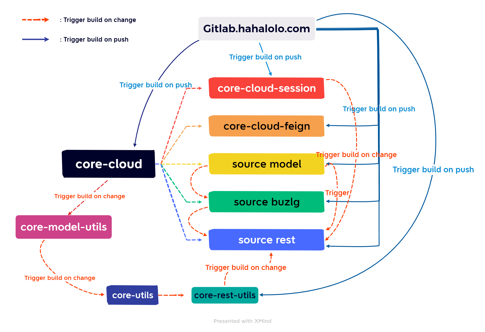

# Workflow

## Trigger in Jenkins (Old)

    Trong server Jenkin build jar, các source được xếp theo mức độ khác nhau:
    Parent: core-cloud -> Trigger build on push gitlab
    Model -> Buzlg -> Rest.

## Trigger in Jenkin for k8s

Tương tự như hệ thống cũ nhưng ko cần build và lưu trữ jar.
